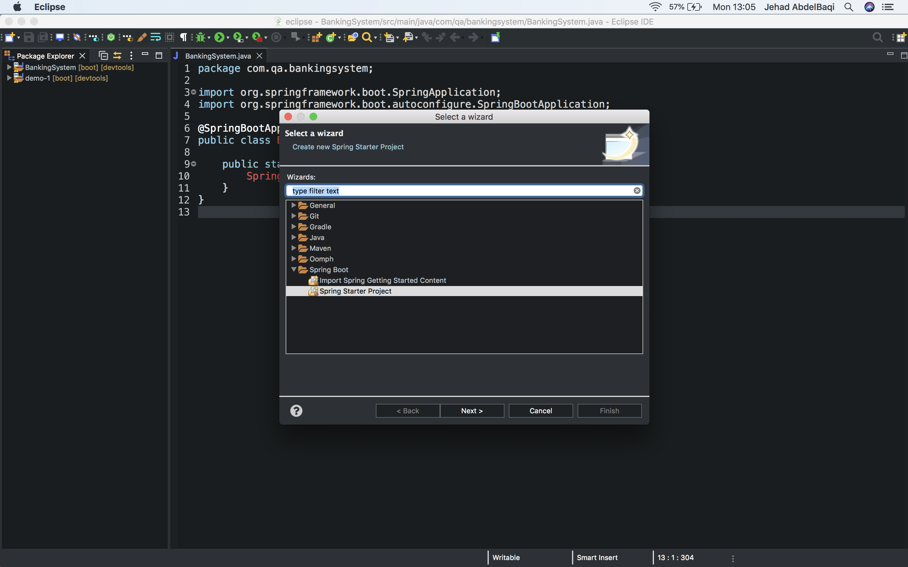
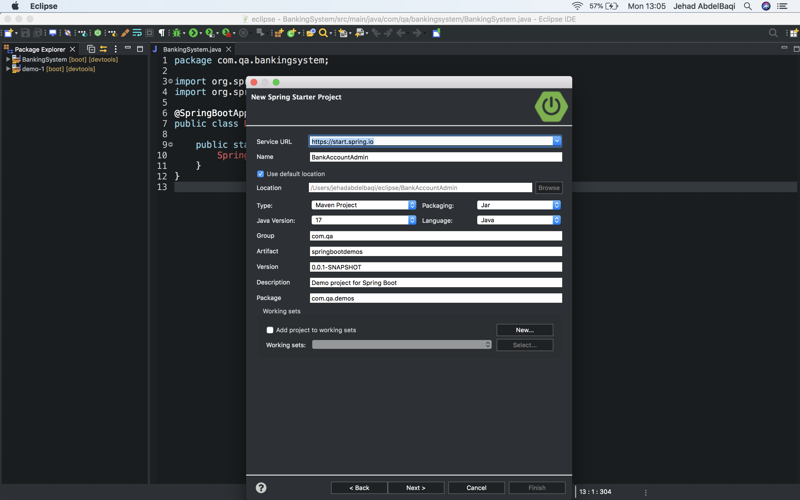
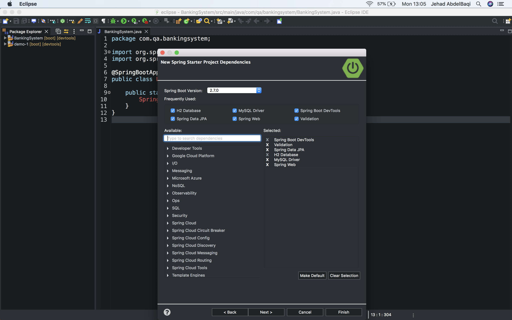

## Setting up your SpringBoot project  

First you click on the file icone on the top left hand side of the page:  
> 

You then name your file and click next.
>  

Finally, you select the dependancies - usually when you have a new project and havent had any previous then the selected dependancies aren't there - you simply search for them and include the ones you want.
>  
