## Creating Runner/Main file and Domain Class using Lombok

Upon the creation of the Springboot project - a runner class with the project name is automatically created with the @SpringBootApplication annotation present. This annotation is used to mark a configuration class that declares one or more @Bean methods and also triggers auto-configuration and component scanning. The project alsop created a pom.xml file with relevant dependancies mentioned in the start-up section and other test folders for resources and testing. The main method within the class also has a SpringApplication.run method. 

SpringApplication.run(Classname.class, args) bootstraps a spring application as a stand-alone application from the main method. It creates an appropriate ApplicationContext instance and load beans. 
>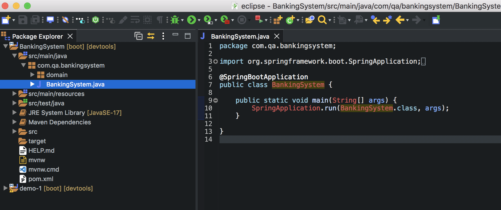 

We then need to set up the connection to the database and the testing environment. We create to files - 3 files - one for the testing environment, one for production environment and the main properties files in which we select which environment we want to the program to run in. The application.properties file in the middle is that file and at the moment I have it set up for testing. The one below is configured to be able to test on a h2 console and we've given it the configuration spec within the file.  
In line one we've told it to enable the H2 console.  
Line 2 we set the url.  
Line 3-5 are the username, password and the console path.  
Line 6 is so we're able to see it as SQL in the testing environment and can run MySQL queries.  Line 7 is an unneeded property (explained below).  
For production it's a little bit more complex since we need it to connect to the actual database.  
Line one is the JDBC URL which in this instance is linked to my own MySQL database. The bit at the end after "?" is us telling it to create a schema with a specified name - if that schema doesn't exist.  
Lines 2 and 3 are the username and database - I've kept them as root for now.  
Line 4 is an unneeded property - it basically tells SpringBoot to put all words in the MySQL queries in double quites in case there is a reserved word by SpringBoot used in the production. These will be commented out since we aren't using any reserved words.  
Line 5 is an automatic update action to be taken when entering data into the database.  
Lines 6 and & are the specific driver and dialect respectively.  
Line 8 is what tells the system you want SpringBoot to make changes - the initialise mode.  
And finally line 9 is the same as before - telling the system we want to use SQL in this program.  
>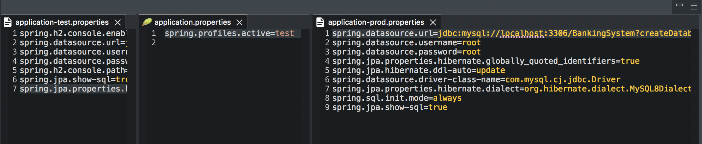 

I then create a config class and just run a couple of tests in there. The @Bean annotation means the method can be found in main by finding the object byName, by type or by both. The hello() method is created in config with this bean and then found by it's name in the main class by using the context.getBean() method and entering the string name of the method to call. In the console the program is run and you can see the method functioning within.
>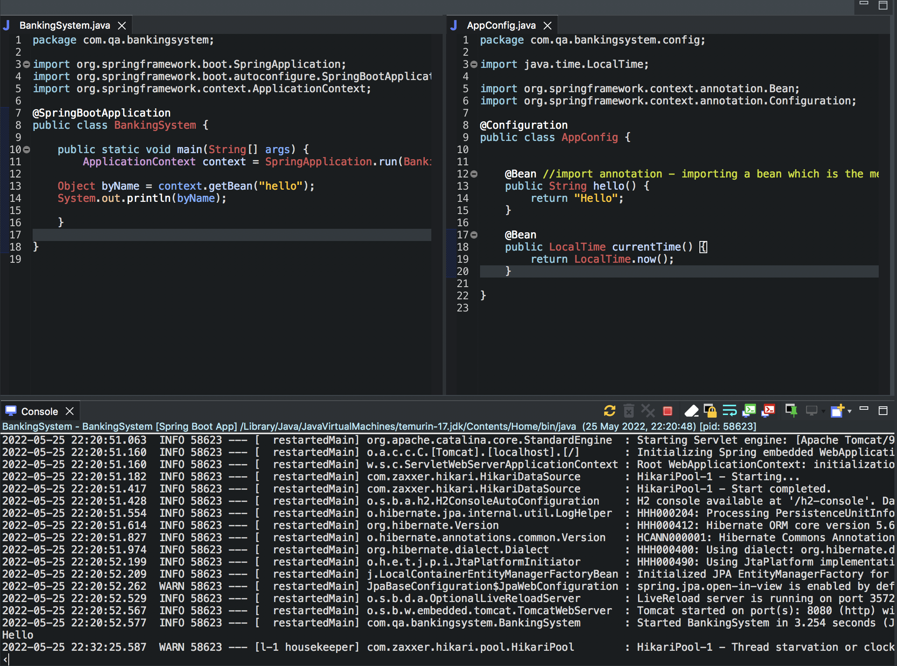 

I also connect to the local h2 test environment online while the program is running. 
>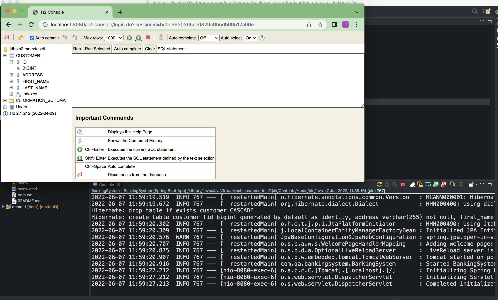 

I then create a domain package and a domain class. Inside of the domain class I annotate the top of the class with @Entity - this annotation tells the application that this is a table creation. Below when creating the first column we specify that it is an id column with the @Id and we use @GenerateValue(strategy = GenerationType.Identity) to tell it this is an auto incrementing id column.
>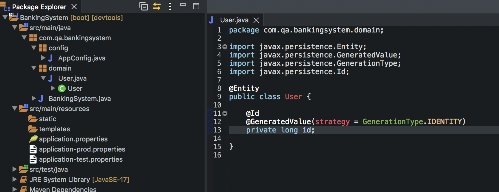 

We the use the @Column annotation to specify the other columns. We can also specify some SQL within the column such as below where we've used (nullable = false) which is the equivalent to NOT_NULL in MySQL.
>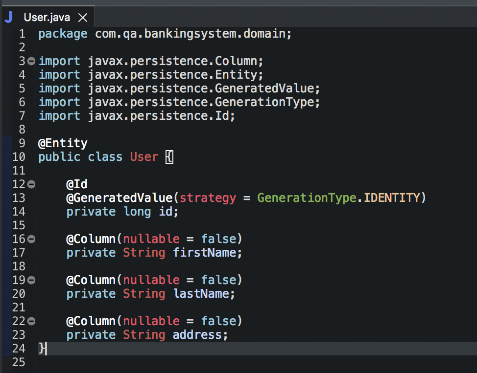 

Generate some constructors.
>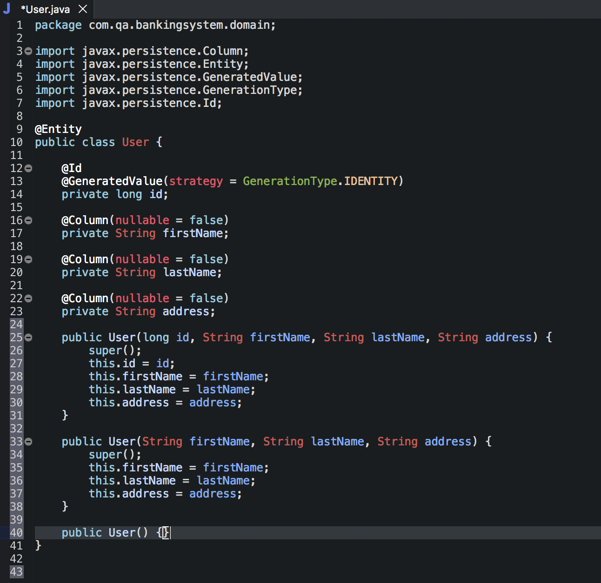 

Getters and setters.
>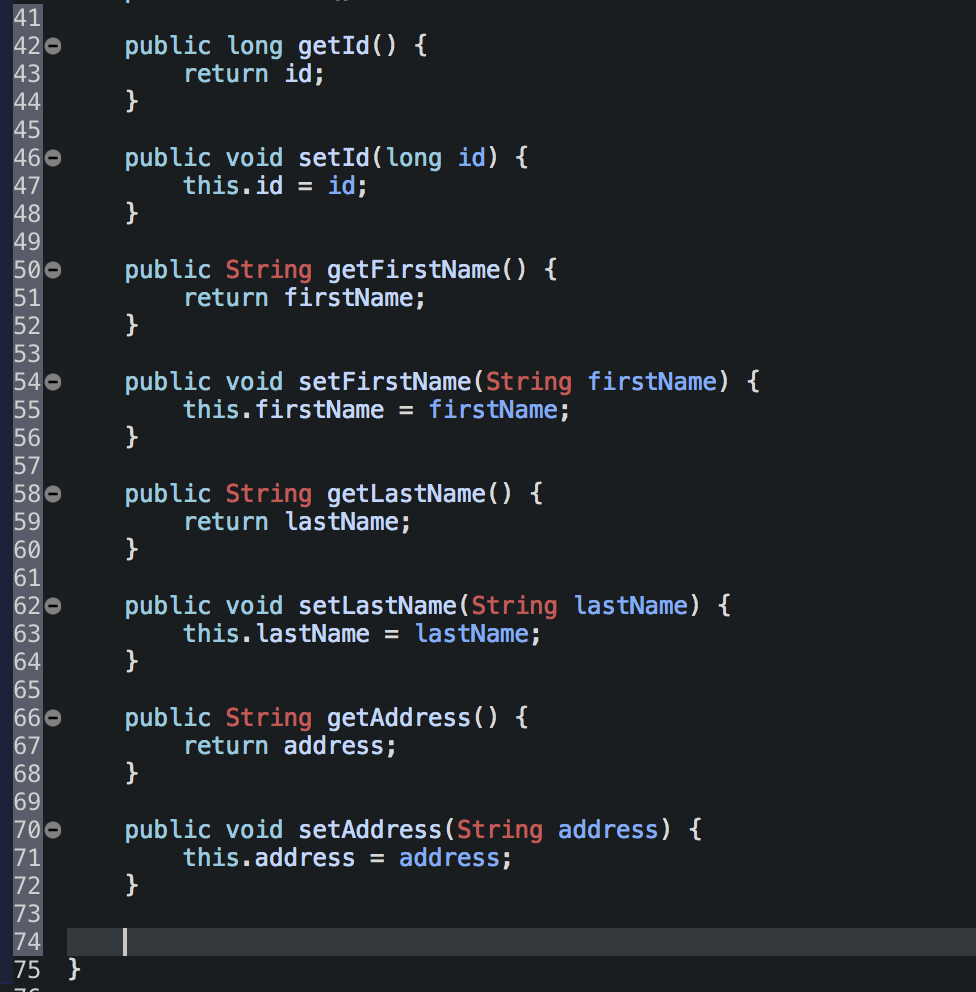 

And Hashcode and equals. (These can all be done by right clicking and clicking source)
>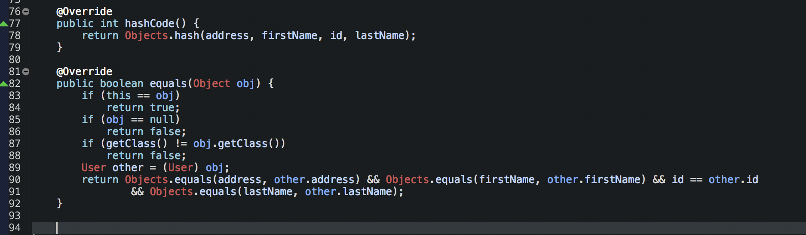 

Lombok is a Java library which aims to reduce boilerplate code by automatically generating common class components such as: constructors, getters and setters, toString(), equals() and hashCode() methods. Lombok need to be downloaded (see main readme file) and then the dependancies below must be added to the pom file (lines 54 to 57):
>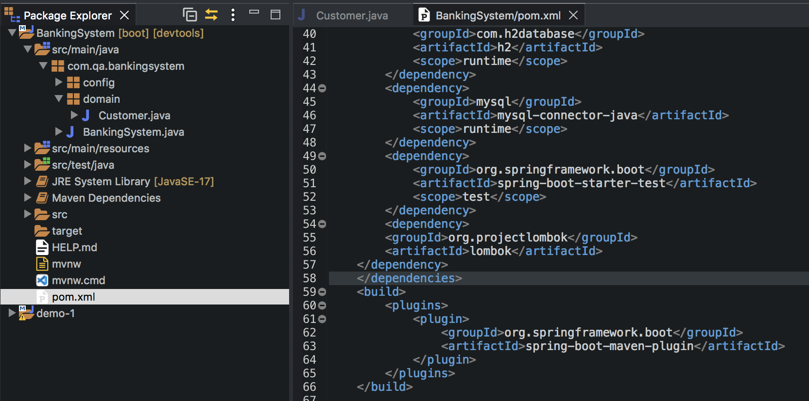 

@NoArgsConstructor generators a constructor with no arguments.  
@AllArgsConstructor does the opposite and generates one with all arguments.  
@Getter and @Setter generates getters and setters.  
And @EqualsAndHashCode generates the equals and hashcode.  
NOTE - if you want to generate specific constructors then you would have to do them manually. As seen in lines 36-41.
>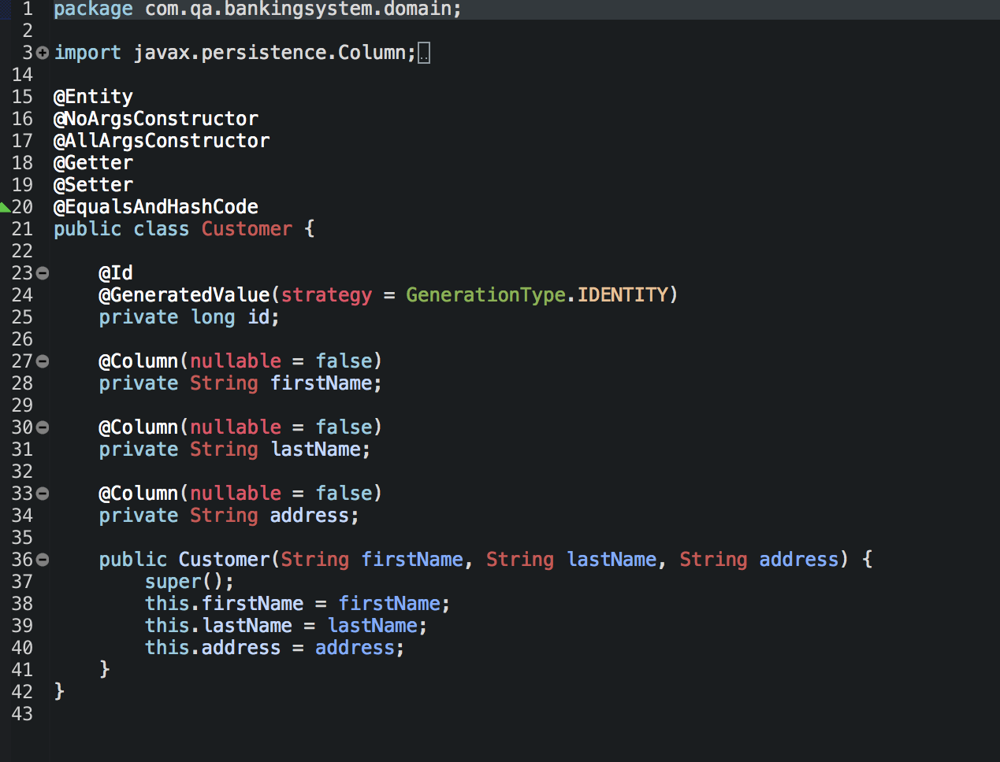  
