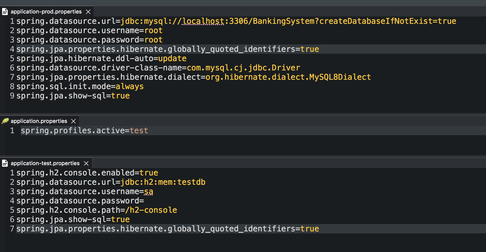

## Creating runner file and domain class using Lombok

Upon the creation of the Springboot project - a runner class with the project name is automatically created with the @SpringBootApplication annotation present. This annotation is used to mark a configuration class that declares one or more @Bean methods and also triggers auto-configuration and component scanning.
> 

You then mname your file and click next.
> 

Finally, you select the dependancies - usually when you have a new project and havent had any previous then the selected dependacies aren't there - you simply search for them and include the ones you want.
> 
> 
> 
> 
> 
> 
> 
> 
> 
