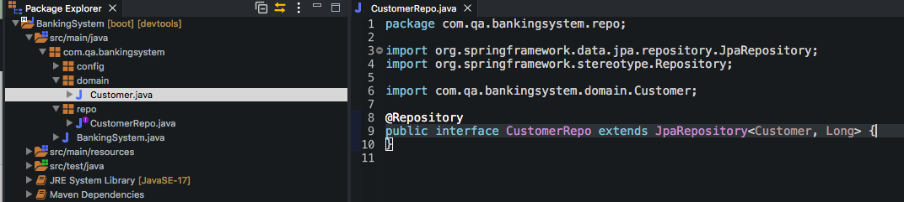
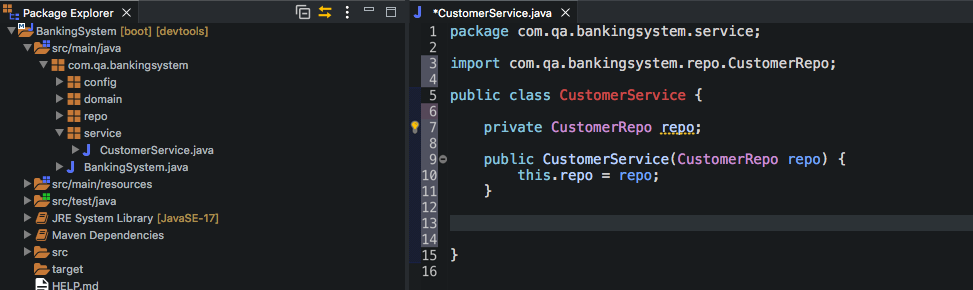
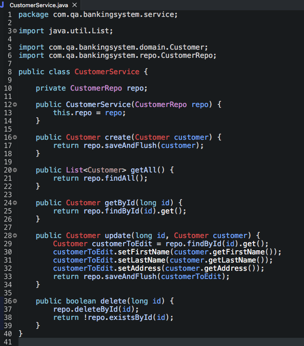
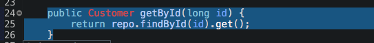
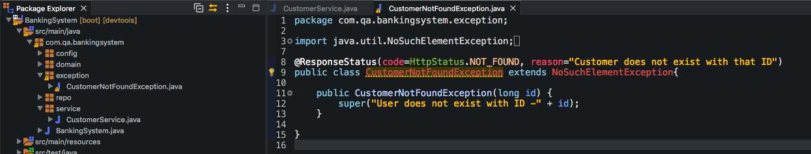
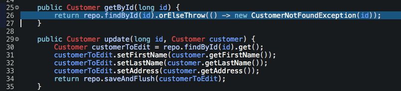

## Creating the Repo interface and Service class.

We create a Repo interface which extends from JpaRepository. JpaRepository is a JPA (Java Persistence API) specific extension of Repository. It contains the full API of CrudRepository and PagingAndSortingRepository. So it contains API for basic CRUD operations and also API for pagination and sorting. We specify by wrapping our domain object (customer in this case) and long (which is for the id) within angle brackets. This way it knows this is what we are using the repository for when calling the crud functionality. The @Repository annotation declares that this class is a repository.
> 

We then Create a Service class and make an instance of the Repo - in which we do an dependancy injection of the Repo into the Service class constructor - this way all the functionality the Repo has - the service now has.
> 

The method creation is then pretty straight forward since we are using methods from the Repo class which has built in crud methods.  
The create method simply calls the repo.saveAndFlush() method.  
The get all returns a List of all the entries by using the repo.findAll() method.  
The getById method calls the repo.findByID method with a .get() method at the end of it. This .get() method throws an exception is the specified id the user typed in to be searched does not exists (more on this later).  
The update method uses the repo.findById method to find the entity you would like to update and saves that as a variable. It then sets the entries of that variable by using the set() methods and finds them using the get() method on the customer we have found using the findById. Finally it uses the SaveAndFlush method on the customer we want to edit.  
Finally the delete method uses the repo.deleteById() method and then returns a boolean by checking existsById(). In this case we want to return exists by id to be true if the entity no longer exists so capitalise before the method name as shown in the picture. This way if the entity does not exist we expect to receive back true.
> 

Above we mentioned that the .get() method used in findById throws an exception No SuchElementException. We want to further this method by inputing more data. We create an exception class and we create a function specifically to handle this exception. What we want is to return the id that was entered by the user (which doesn't exist). We then make a super constructor with a message left but we should have gotten rid of the reason shown below. Later on in the popastman section you will see this function didn't work as planned since I left the reason in the @ResponseStatus annotation. The @ResponseAnnotation tells us which HTTP code we should receive back with this exception and a message (which we can specify) as the reason to why this exception has been thrown. Since I didn't remove the reason in this scenario - the reason specified in the annotation will supercede the constructor created below.
> 
> 

Nevertheless the exception is added to the findById instead of the .get() as previous - it is also added to the findById method below in the update method (which wasn't done in this screenshot).
> 
