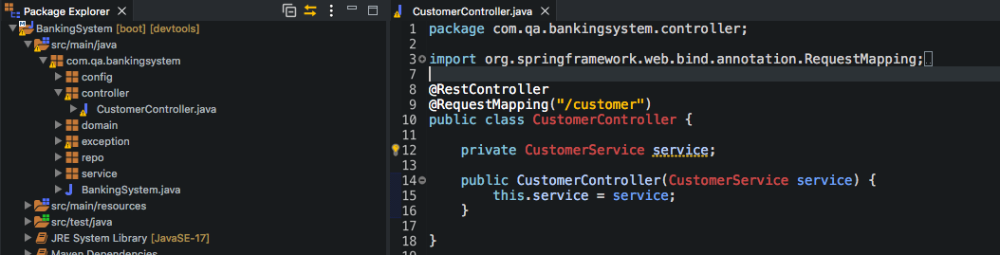
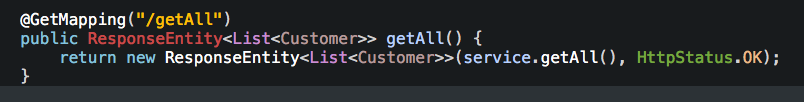
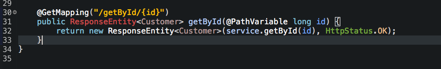
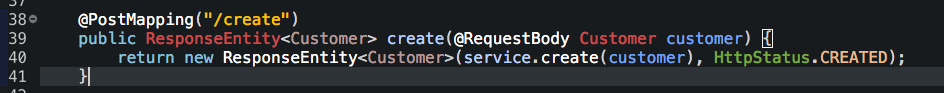
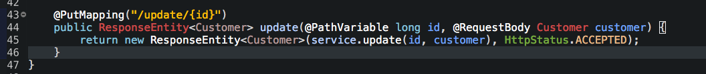
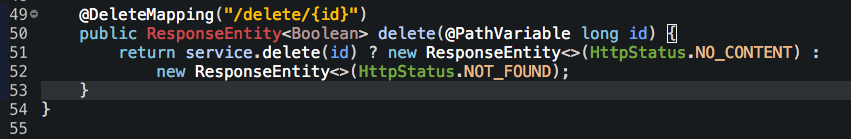
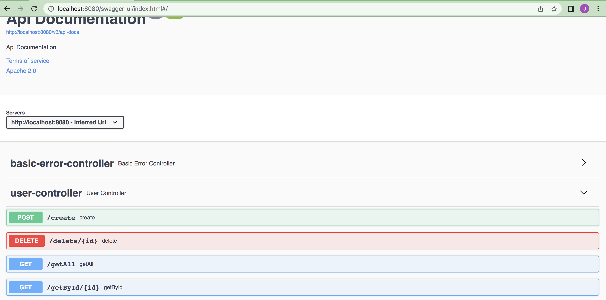

## Controller Class 

We now want to make a Controller class where our methods will actually be called. There is now a dependancy or a control flow - we want the controller to take from the Service and Service takes from the Repo. First we use the @RestController to declare that this class is a controller. Then we use @RequestMapping annotation which is used to map HTTP requests to handler methods of MVC and REST controllers. In layman - what we specify inside this annotation is an added request route we will have to follow to use our CRUD methods. If our database is located in localhost:8080 then whenever we want to access it we will have to use whatever was entered in the RequestMapping - in this instance localhost:8080/customer.  
Again we use dependancy injection - this time injecting the Service into the Controller class.
>  

For the getAll() method we first use the @GetMapping annotation which declares this function is a going to retrieve data - we also again specify the route we want to go down (in this instance it's "/getAll") - meaning the full address for this method is now localhost:8080/customer/getAll. In this method we are expecting a ResponseEntity return - which is a HttpStatus. But we want our actual results to be wrapped inside so the ResponseEntity is of type List with Customer wrapped inside of it. So we expect back a ResponseEntity with a list of our customers. The return is a new Response entity with the service.getAll() method and a HttpStatus.OK to tell us the method get request was succesful.
>  

The getById() method does the exact same thing but there is a difference. in the argument of the @GetMapping Annotation we must specify we are looking for an entity by using it's id. We do this by using another forwards slash and then putting the variable we want to save inside curly brackets. We then specify the variable by using @PathVariable in the method parameters and give the same variable name. Meaning is the variable in this case wasn't id the whatever is specified in the method parameters must match the @GetMapping parameter variable. 
>  

The create() method uses the @PostMapping annotation since this is now a post or (create) method. It also uses the @RequestBody annotation - this isn't just a path variable but is a complete object so we have to use the @RequestBody annotation. We also customer insice of ResponseEntity and return a HttpStatus.CREATED.
>  

The update() method takes both @PathVariable and @RequestBody - since it needs an id to know which body (or entity) it is updating. The HttpStatus.ACCEPTED is relevant for this method.
> 

And finally the delete() method takes a @PathVariable since we need to specify the id which is deleted. The return is just a response entity since nothing needs to be in the body since we are deleting something which exists. We do use a ternary if since the delete method returns either true or false. If true it works and returns HttpStatus.NO_CONTENT. How ever if false it will return NOT_FOUND meaning the entity we tried to delete was not found. 
> 

You can see the methods also using swagger by typing @EnableWebMvc on top of the class in the runner. The link you should type in the browser is seen below.
> 
