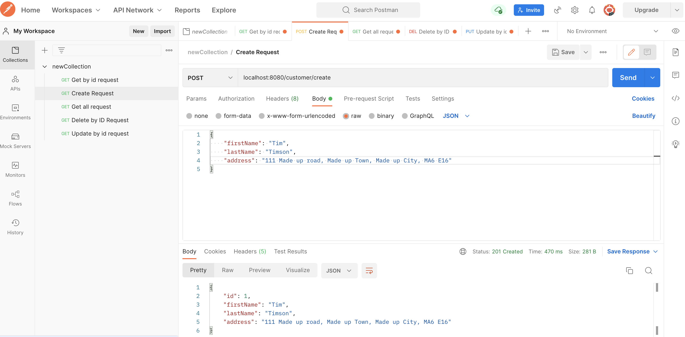
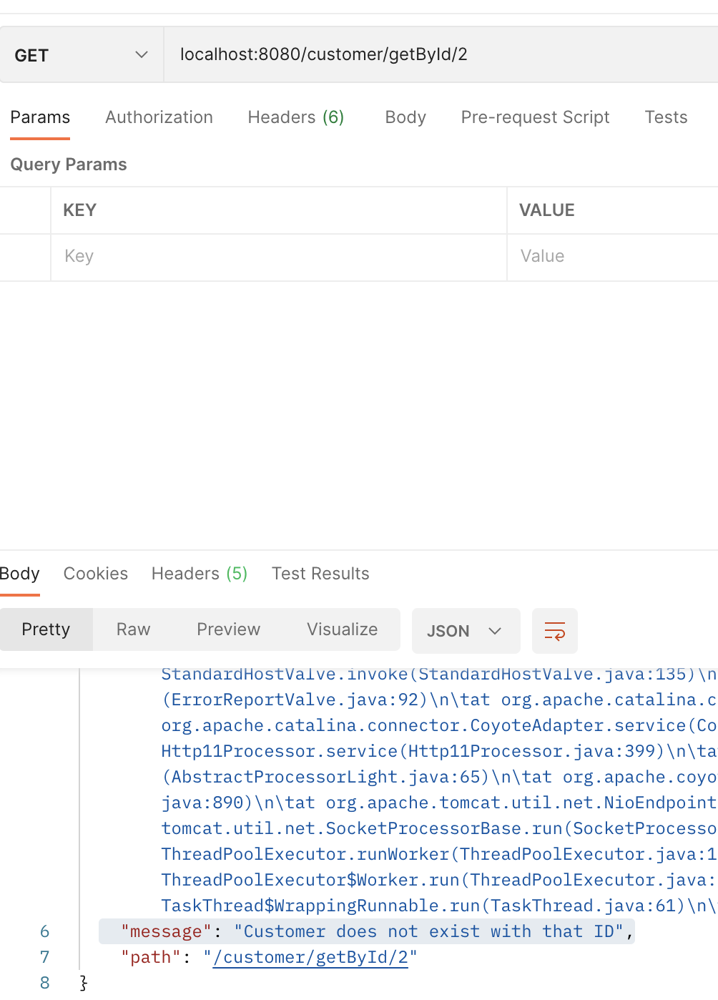
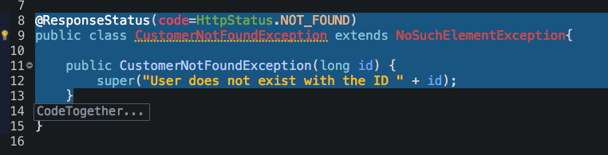
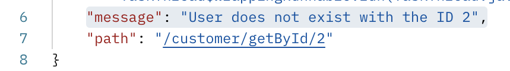
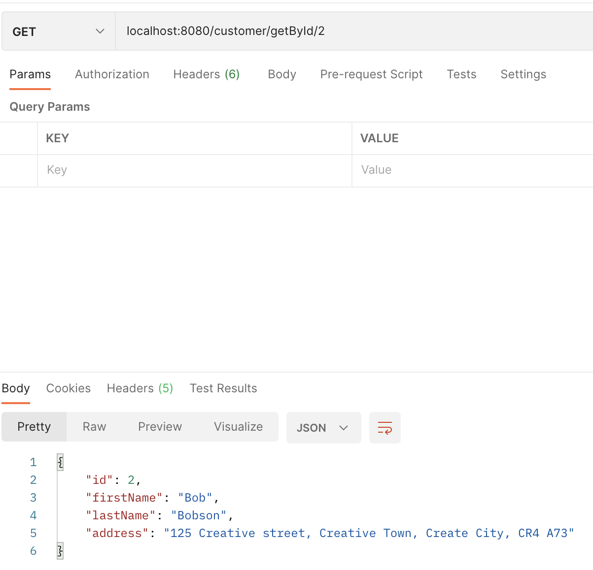
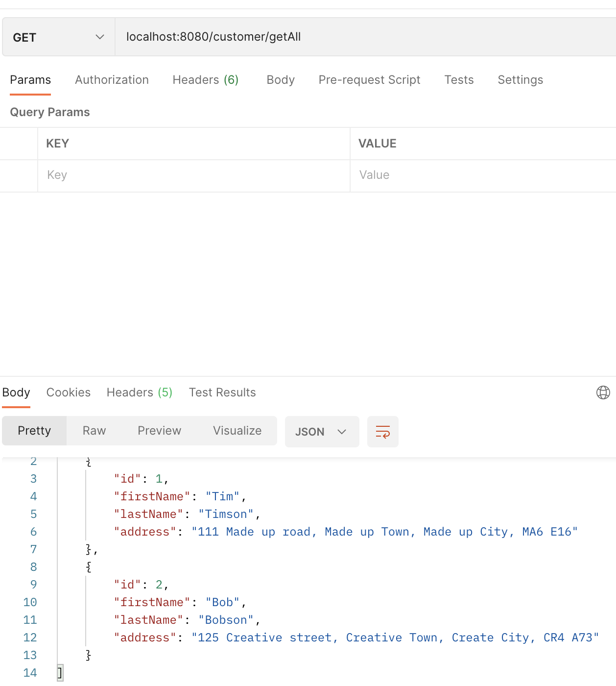
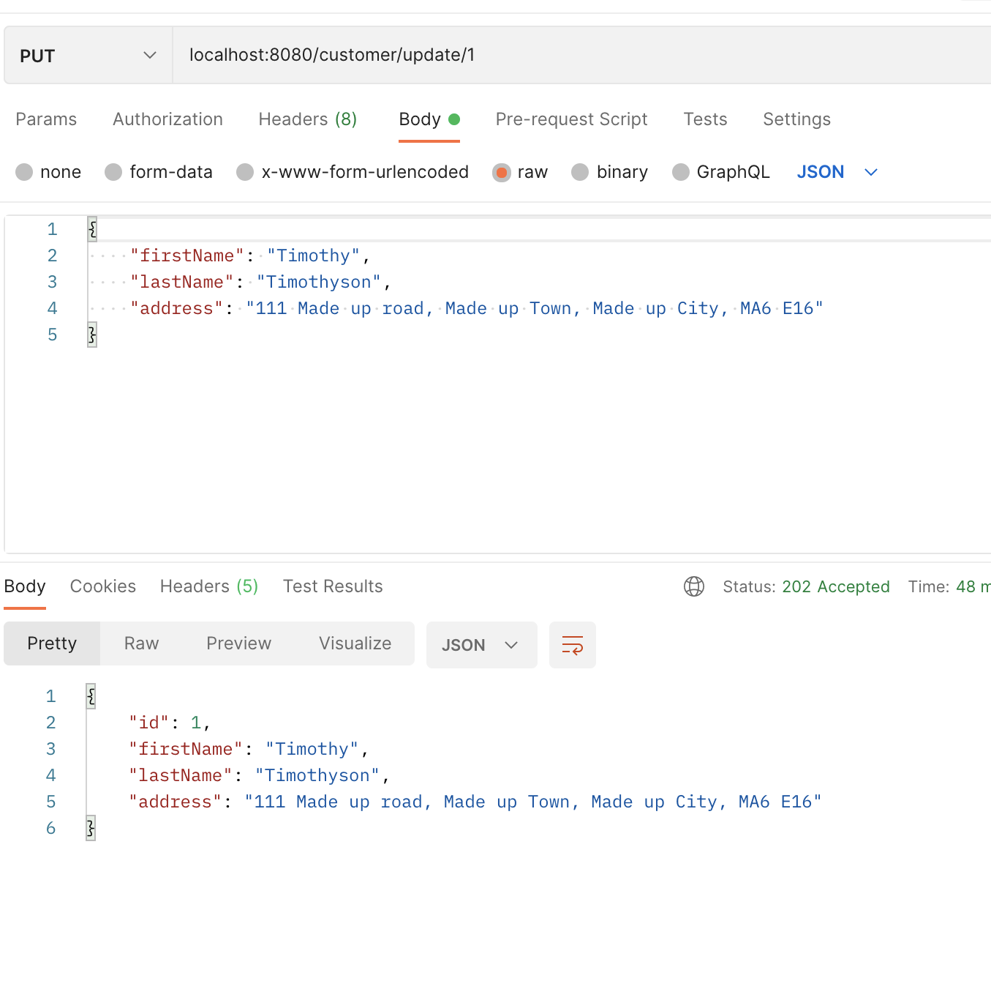
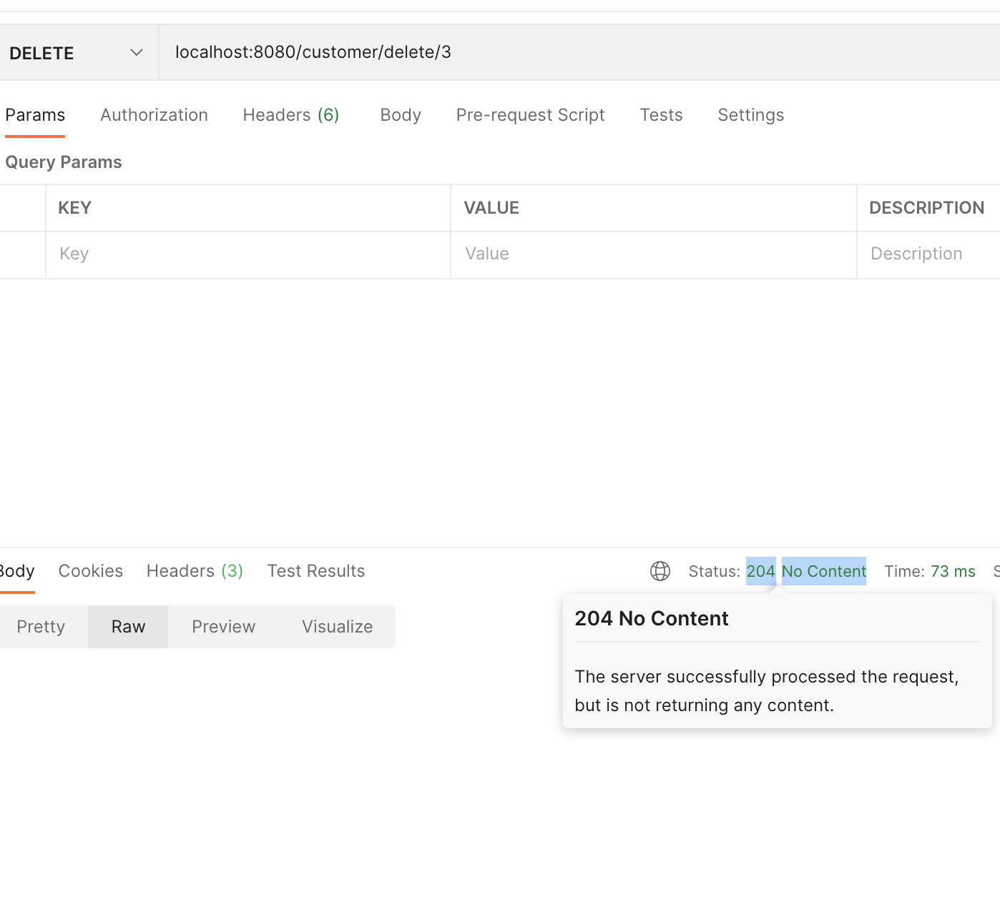
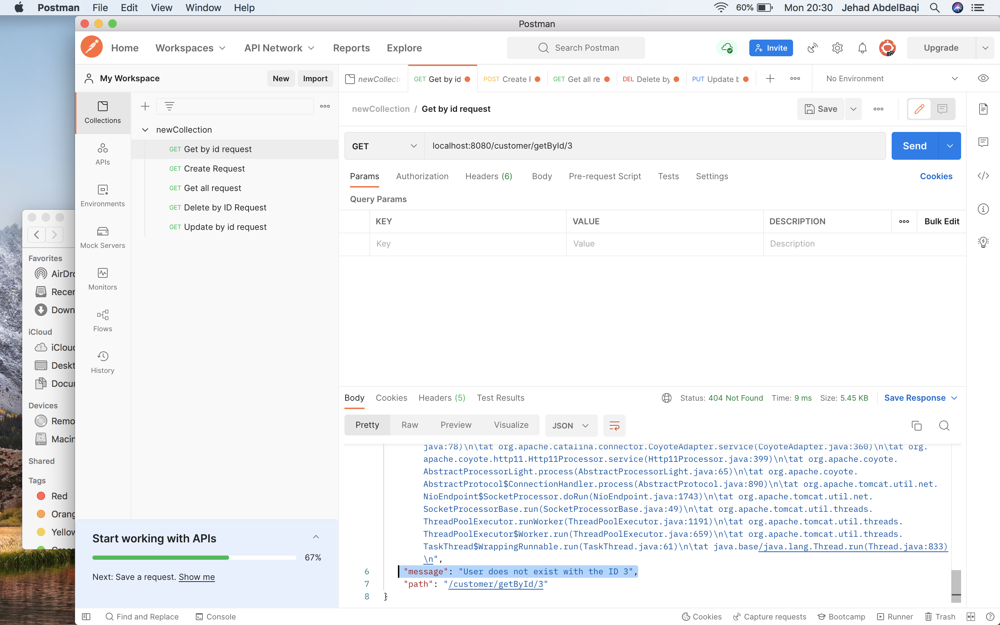
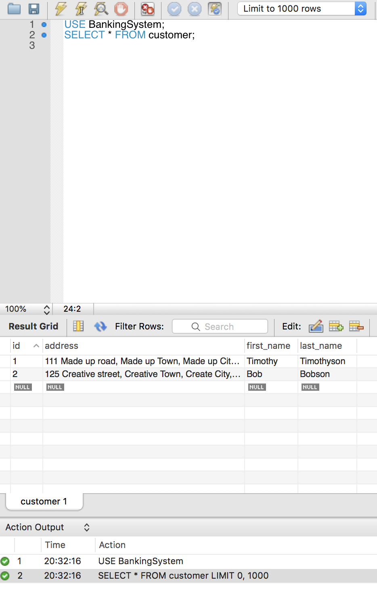

## Checking working files on Postman and MySQL 

I created a series of API calls usiong Postman to check if my methods were working prior to testing.

Started with a create call.
>  
As mentioned previously - the getById method had an exception thrown from a class - in that exception I never removed the reason from the @REponseStatus annotation. Therefore the below message was showing up.
>  

Finally, you select the dependancies - usually when you have a new project and havent had any previous then the selected dependancies aren't there - you simply search for them and include the ones you want.
> 
>  
>  
>  
>  
>  
>  
>  

