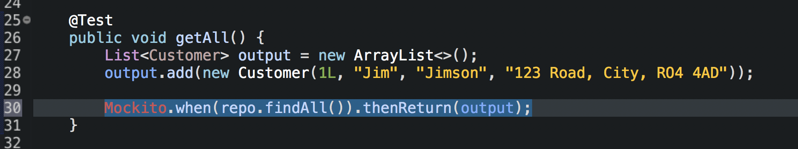
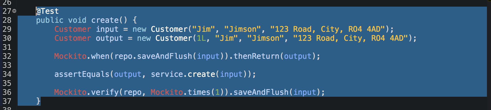

## Unit Testing

This file was created automatically when the project was started as a SpringBoot project. The @SpringBootTest annotation tells declares that everything in these files will be tested via SpringBoot.
>  

Since we are doing unit testing and we are testing the service. The file path of testing has to follow the same same file path as main. So we create a Service package and a class for testing within that package. This is a unit test since service holds individual units (methods) which we want to test alone without going to their dependancies (in this instance the Repo class). We must Mock the Repo class by using the @MockBean annotation and placing and instance of the Repo in there. This now declares that the Repo is to be mocked when specified within a test.
>  

We then import the class we are actually testing under the annotation @Autowired. This tells SpringBoot to construct this Bean automatically using the mock above (which is placed below in the code) - so the service that we are not using is going to contact a mock Repo and not a real Repo since there is a mock bean annotation on the Repo.
>  

We start writing our getAll test and we know getAll() should return a list of customers. We Create and empty list and insert a customer in there. We then use |Mockito.when(repo.findAll()).thenReturn(output)| this is where we mock the Repo method. By saying this is the Repo method we want you to mock and the thenReturn is the expected outcome in the parenthesis.
>  
>  

As per normal testing we use the assertEquals and give the expected output and method used in the argument.
>  

We then verify that the mock worked by using |Mockito.verify(repo, Mockito.times(1)).findAl();| - this is basically verifying that the repo class used the method one time and that method was findAll().
> 

We test the method and we can see that the test didn't go to the Repo since we mocked it.
>  

When making the getByIdTes()t we have to bear in mind the getById() method returns an Optional with a customer wrapped inside of it - so we have to mock an optional in this test. So we create normal customer entry and then we create an optional output by taking the first output and using the Optional.of method.
>

We then repeat the same steps we did in the other test this time mocking the Optional return instead. The results are again in the 100s.
>  

With the updateTest() we have to first take an input which is the updated result without an ID. Then we create and Optional which takes is a customer with an ID representing what is already in the database since the update() method in service uses a wrapped user in an Optional. The output here resembles the updated version (inout credentials) and the id taken from the existing customer.
>

We now have to mock two results - both the findById() (since the update method is using findById() to find the customer to update) and save and flush since it is saving the new input that we have given it.
>  

Again assertEquals and verify the mocks.
>  

For create, we create an input as the data we will input into the entry and an output which includes the ID - we then mock the Repo - and follow the same steps as before.
> 

the delete() method doesn’t need to take any inputs or outputs so we just mock the Repo existsById() and then do the checks - since existsById() should return false BUT service.delete() should return true (meaning the function worked).
> 

Here are all unit tests for the service.
>  

