## Integration Testing

For integration testing - unlike unit testing - we have to test the entire system function and works with all the dependancies. So we need to set up a testing environment for this to happen. We use the normal @SpringBootTest to declare this is a springBoot testing class. Then we use the @AutoConfigureMockMvc annotation to configure the mock we are going to generate below. The @ActiveProfiles annotation declares that here we don't want to enter into our main database since we've fed the body of the annotation a "test". We instead want to send these requests to the H2 testing environment we set up earlier.
>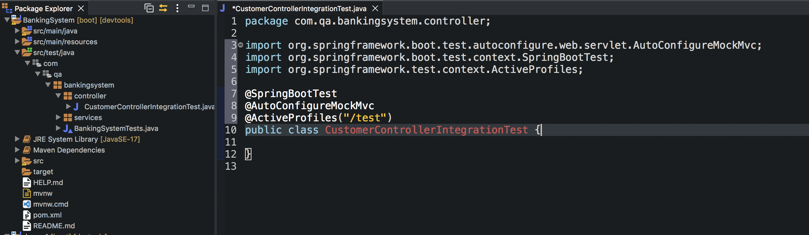 

We then create two mySQL scripts which create a Table and insert values into them. These are going to be used as our test environment database.
>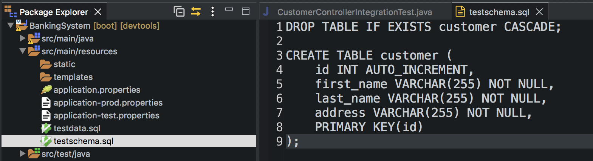  
>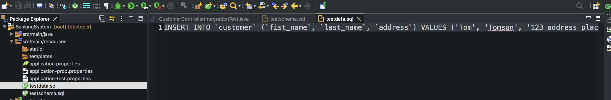 

We then add a @Sql annotation and feed it the scripts we are using for these tests - and we also declare at the end that the executionPhase is to be BEFORE_TEST_METHOD. This basically means before every single test the testing database will reset. This is needed so the testing database doesn't pile up with data that's not needed and it means we can run the same tests over and over again and no new entries will be made into the database.
>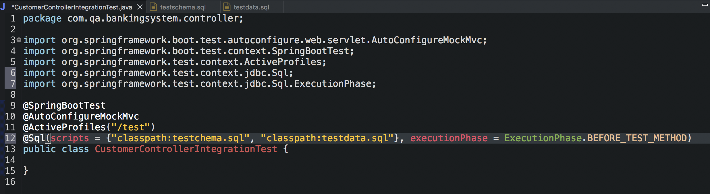  

We then create two objects - MockMvc which is going to get configured by the annotation above and this is what we need to do our mock http requests to kick off our controller for these tests. And we also need an object mapper which is what used to convert data from and to JSON. Both auto wired.
>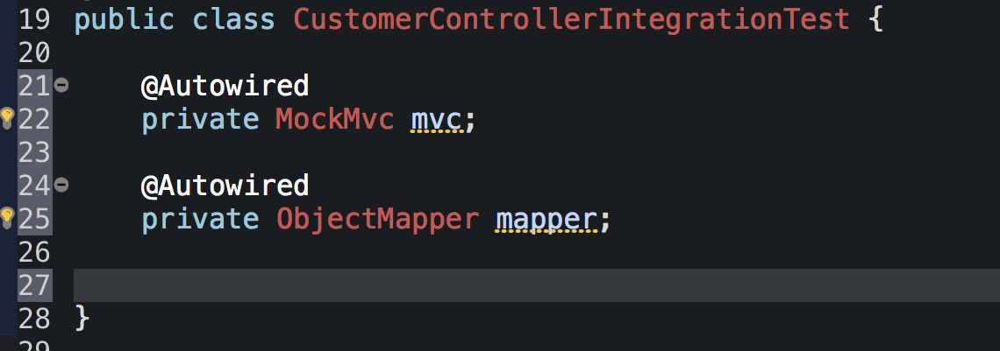  

We start with the createTest(). Very simply we make a customer input and we convert the input into JSON using the mapper. 
>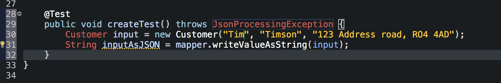  

We then write up an expected output and convert that to JSON as well.
>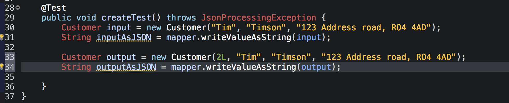  

We then get the Mvc to perform a post request with the relevant endpoint - we specify the MediaType to JSON, we feed the content to be our input (which we converted to JSON and then the expect back two things - a created status and the output as JSON. 
>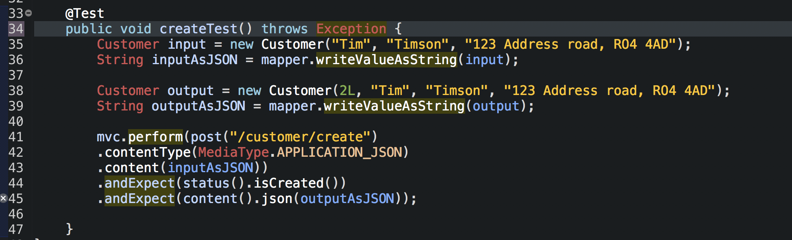  

As mentioned earlier we got back and comment out the globally identified line on our properties files.
>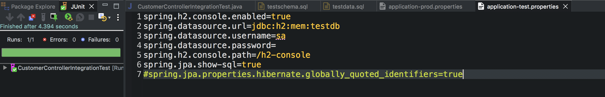  
>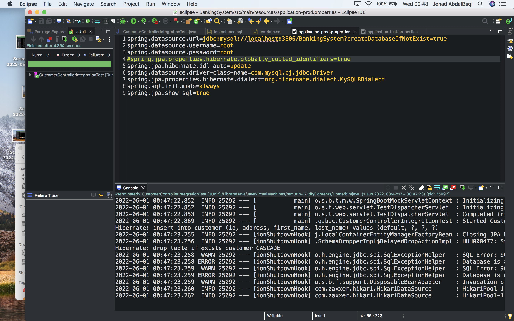  

The getAll() and getByID() tests are very similar to the unit testing - this time it's just with the JSON and expected status outcomes.
>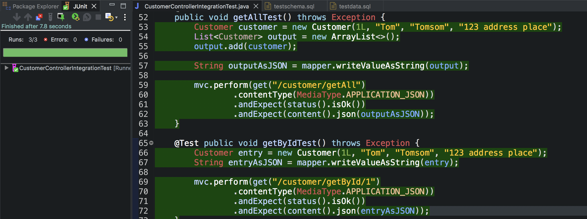  

Same for update() and delete().
>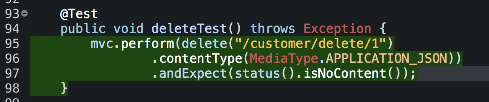  

Passes on all tests.
>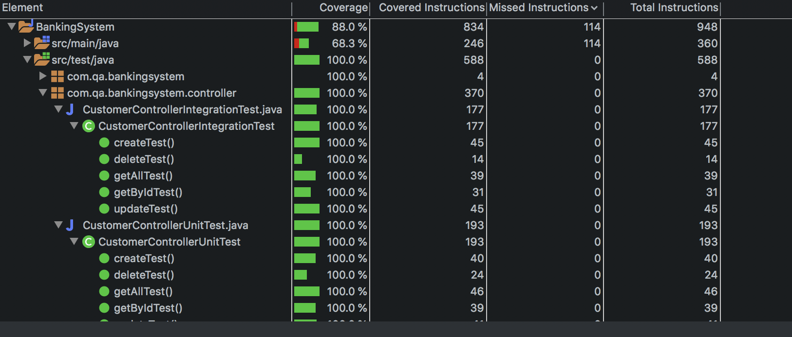  
