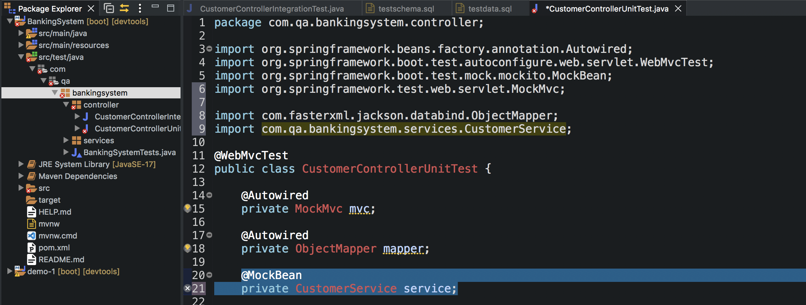
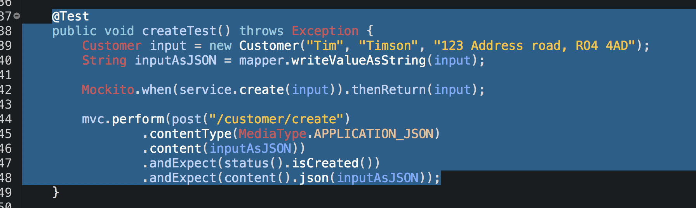
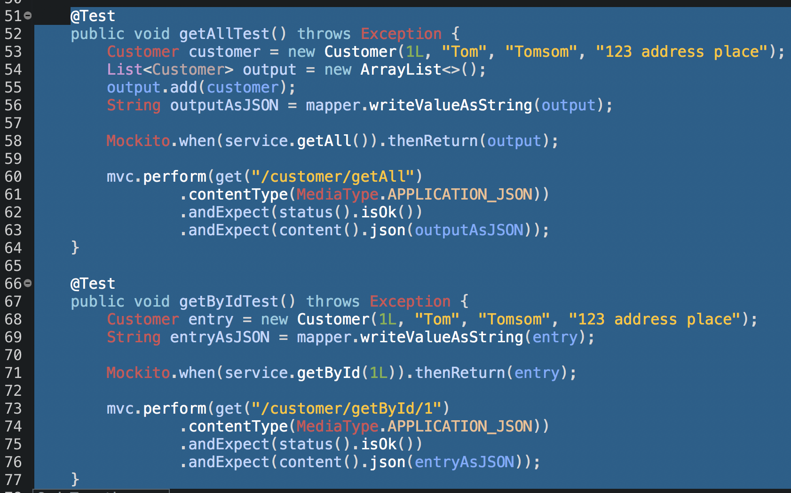

## Controller Unit Testing

Much like the unit testing we did earlier for the Service class the controller unit testing mocks any dependanceis - the only difference is this time we are expecting back JSON data and status codes. So the below trsts are a mixture of the Service unit testing and integration testing.

@WebMvcTest is the only annotation we need since this is a unit test - we’re still going to send the same request but this time the service will be mocked as we create a mock bean of the user service to stop the controller from talking to the service - that’s why we add the mock bean on service.
> 

As mentioned above - the create() test is the same as the integration test in some ways - but this time we remove the expected out and we mock the service method - we then perform our HTTP request as normal.
>  

Same with getById() and getAll().
>  

The update() and delete().
> 
