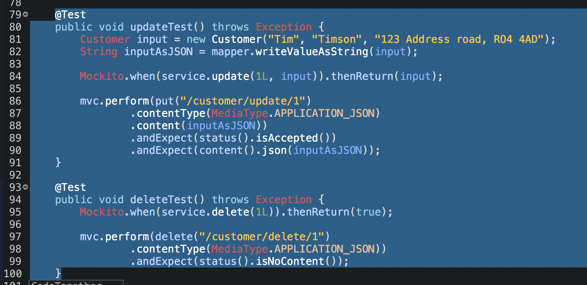

## Controller Unit Testing

@WebMvcTest is the only annotation we need since this is a unit test - we’re still going to send the same request but this time the service will be mocked as we create a mock bean of the user service to stop the controller from talking to the service - that’s why we add the mock bean on service.
> 

You then name your file and click next.
>  

Finally, you select the dependancies - usually when you have a new project and havent had any previous then the selected dependancies aren't there - you simply search for them and include the ones you want.
>  
> 
