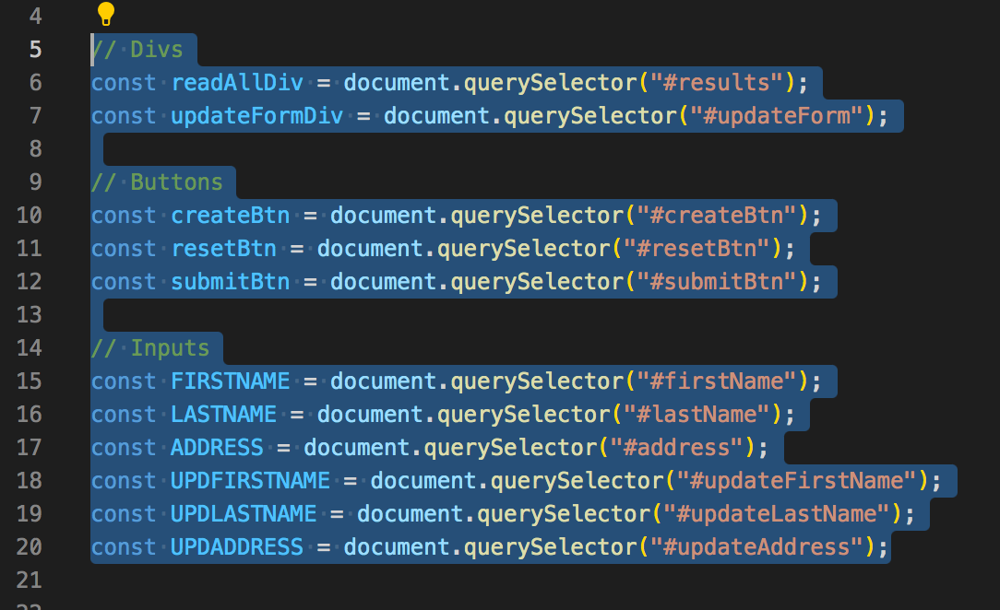

## All Frontend  

Nopw it's time to work on the frontend.  

Frist we make a HTML index page. We give the title in the heading.
>  

Initially we want to just make a div for results and a button to get us the results. We also link a script tag to the JS file we're going to create (line 14).
> 

At this point this is what our page looks like. There is only a get button and a title in the page tab.
>  

To test our get button, we make this axios request of the type "get" and we link it to our database URL. The program must be running for this to function. At this moment in time we just want a console log of the data. We know our getAll function will return back all the data so we save that as a "res" variable and we ask to retrieve the data from the res. On line 3 we as a query selector using the id of the get button from the index page. and on line 19 we add an event listener to let the program know we want our getRequest method to run when the button is clicked.
>  

We get an error which is easily fixed.
> 

We go back to our CustomerController class and we add an annotation of @CrossOrigin (although this wasn't the reason our code wasn't working) so we don't get an error which is cross origin resource violation.
>

 The actual error was here - we hadn't used the script tag to tell html we want to use axios so we add that script. Now the console is loggin our data.
> 

To display our results in our actual page though we made a variable using the results id for the div tag in html. We then run a method which loops through the data and we insert each element (line 24) as formatted text into the results div which a paragraph element we created and then finally append that into the results div. We also feed the displayResult method into the getRequest method in line 10 instead of the console log. This will now display those results onto the actual page.
>  

We then input a property called "onload" into our body tag in the HTML file and we give it the function set up - which we specify is going to run the getRequest method when the page loads. Rendering our get button useless since the results will be loaded on the page when the page is loaded via the onlaod property.
>  
> 

We then make a style sheet and I've used the link from bootstrap which is a library for CSS styling and also my own CSS link which I specify in the head. I also use the script below to link the bootstrap to JS.
>  

I revamp my displayResults - I basically added two buttons (delete and edit) and created text withi them. I set up classes, ids and values for them using the setAttribute method and then appended them into the entryDiv. The value i set is the entry.id which means each button will take the specific id of the button pressed.
>  

I then did some work on HTML - on line 18 i set this div with the class banner and within I fed it a logo in the header (which will be at the top of the page). I then created a table and inserted a box with a from inside of the box. This form is for our create inputs. In the placeholder i added a space - this gives a specific type of functionality when added with the CSS which keeps the placeholder present but moves it upwards when the button is clicked (check CSS input class). Here is a [link](https://dev.to/felix/floating-input-placeholders-with-html-css-ej4) with a walkthrough to set that up.
>  

Here is some of the styling - the main bit is .banner which takes a picture as the background in the url. The rgba before it sets the colour of the picture and the last argument is how present the picture will be 1 being the most and 0 being the least. Here is a [link](https://www.youtube.com/watch?v=PgAZ8KzfhO8) which explains this.
>  
>  

This is what the website looks like now.
>  

Going back to the JS file I revamp it a little bit by setting up an updateFormDiv (which I've created i HTML for the update form (which we'll get to). I also now have selected a create and reset button for the create form and a submit button which will be used for the update form. Then i set variables for the inputs - the create form inputs and the update form inputs. 
>  

The create method is quite simple. We take the input variables we saved and save them as a a new variable - then we create an object using those values. And we simple input the object into the axios post method which takes our create endpoint. We then reset the values (88-90) so there's nothing there. Those 3 lines of code are the same function which run when the reset button is hit in the create form and the cancel button in the update from.
>  

For delete and update we go back to the displayResult method since those buttons are located there. on lines 67 and 68 we set an event listener if any of those buttons are pressed then we call the function specified with the entry id as the argument wince we need to know which entry we are updating or deleting.
>  

The delete function is here - simple axios delete method calling the id of the delte button pressed.
>  

Here is a look at the HTML update form. The class I've set for it is specific since an actual separate from comes up when the edit button is clicked. But the rest is similar to the create form.
>  

The important part here when editing the class is the display which I've set as none on line 100. This means this form is not apparent on the screen. The next picture shows you how this will become apparent on the screen. Here is a [link](https://www.youtube.com/watch?v=gLWIYk0Sd38) for a walkthough on this.
>  

When the edit button is clicked the update method is activated - we then select the .bg-modal class using query selector and we change the style.display to "flex" this will render the form on the screen. We then set another query selector for the cancel button on the form - we add an event listener to the .close class and we say if the button is pressed then revert the .bg-modal style.display back to "none" and then delete the values of the inputs.
>  

The remainder of the function is straight forward - when the submit button is pressed, similar to the create method we just take the inputs and save them into an object and pass that object into the update method - the update method knows which id to update since we passed it through the displayResults function. On line 139 we reset the display of the form back to none and delete all the values so if's opened again the values are empty.
>  
