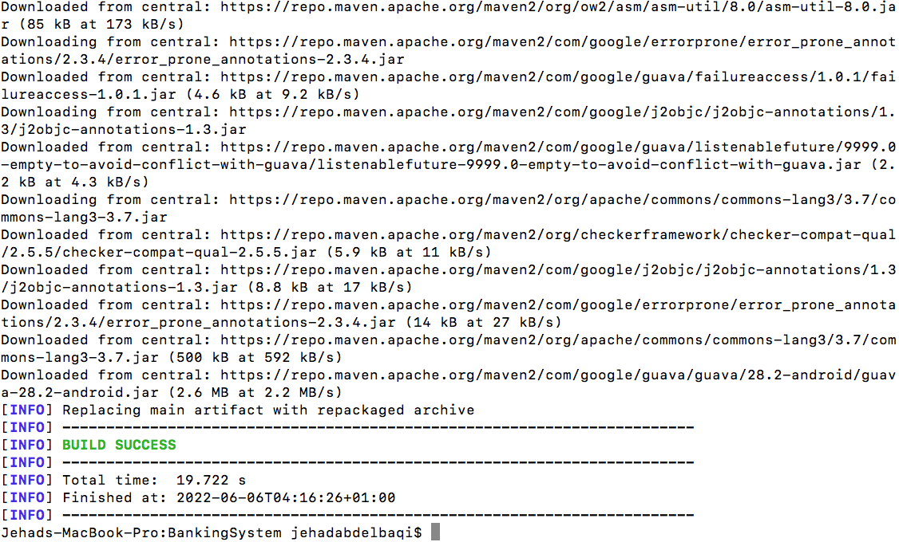
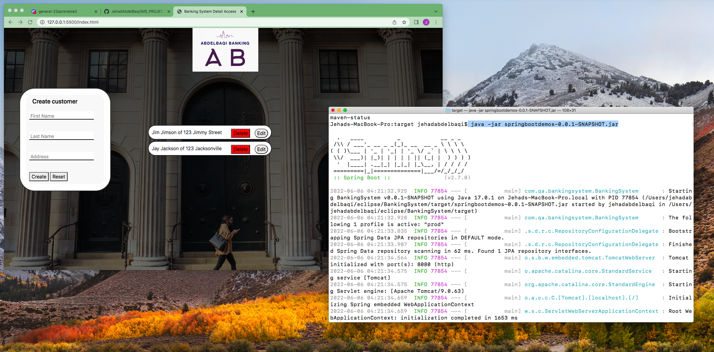
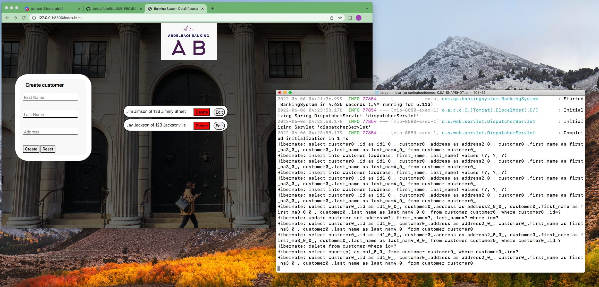

## Final Build

To build the project you go onto your terminal and go to the project folder. On the project folder you type in mvn clean build. The terminal will then build your application - upon completion a target folder is made and within in a jar file should be present.
> 

you then run the command java -jar <filename>. And as you can see the program is now running on the terminal and is also communicating with the website (since we can see database entries on the webpage).
>  

Any edits we make are rendering are being completed based on the terminal updates.
>  
