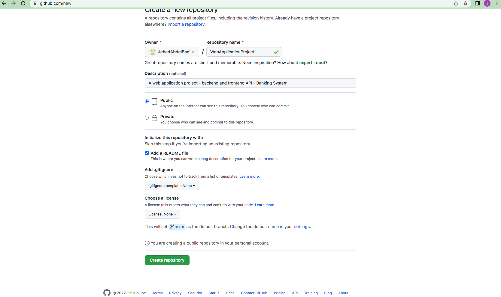
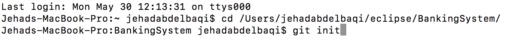
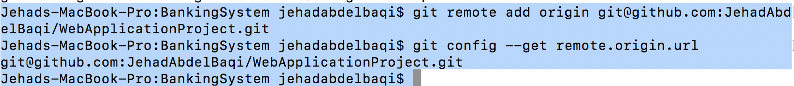
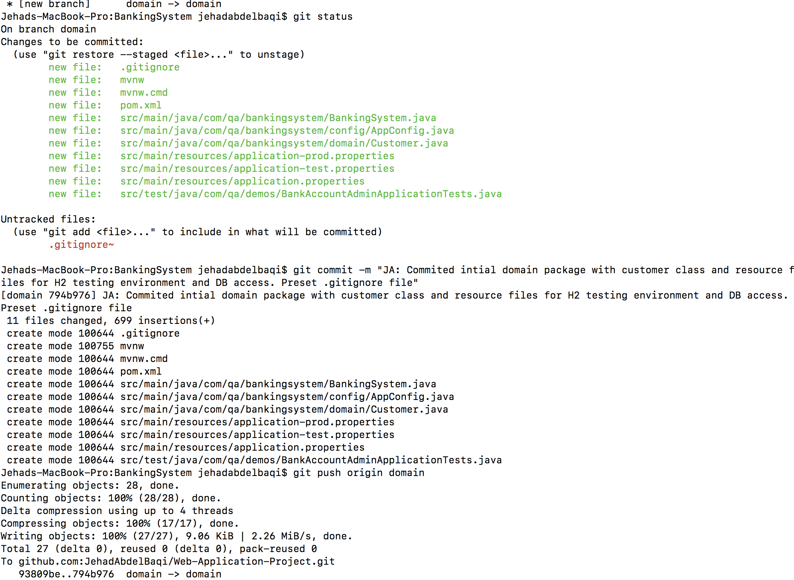
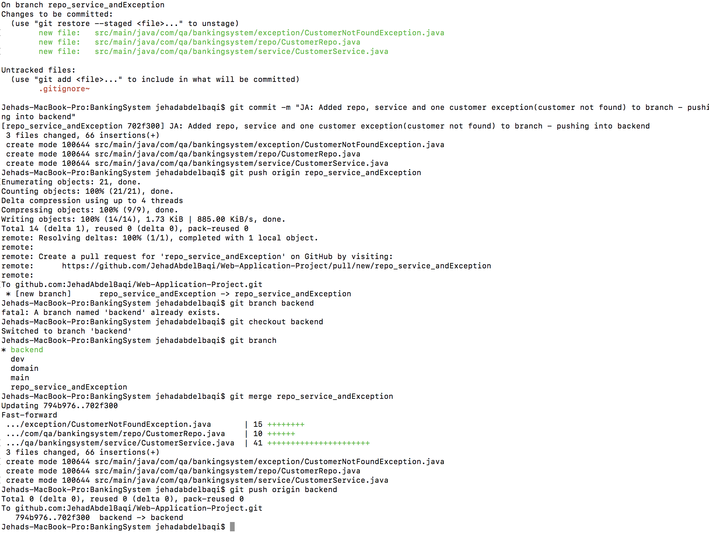
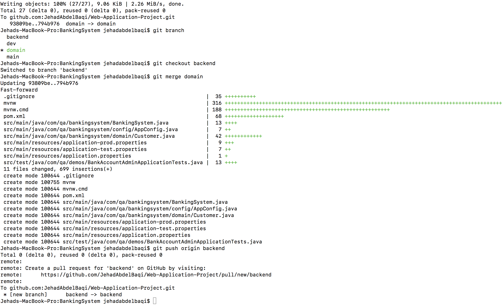

## Source Control use

To track and make changes to our progress we use Git and GitHub to crete and push updates to the server. 

The frist thing we do is create a repository on GitHub.
> 

We then go to our project file and use the git init command to make this into a git folder.
> 

We then use the git add origin <url> and use the url of the GitHub repository. I ran into some issues wince I created and deleted the origin I had linked my foder to so I had to use the following git commands to reset it to the new GitHub repository.
> 
> 

I then made a dev branch and seperate other branches depending on the workflow I wanted to follow. I then made my first push into domain. And then merged that with dev.
> 
> 

And then continued doing the same throughout the project.
> 
